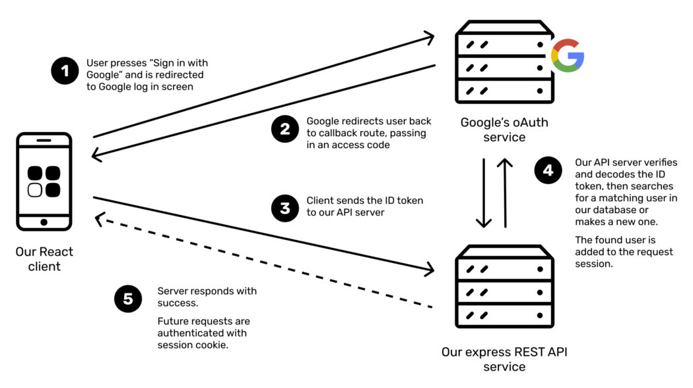

# googleauth

# Build
```
go get github.com/gorilla/pat
go get markbates/goth
go mod download cloud.google.com/go
go get github.com/gorilla/sessions
go get github.com/joho/godotenv
```

# Run

```
go run main.go
```

# Goal

  
